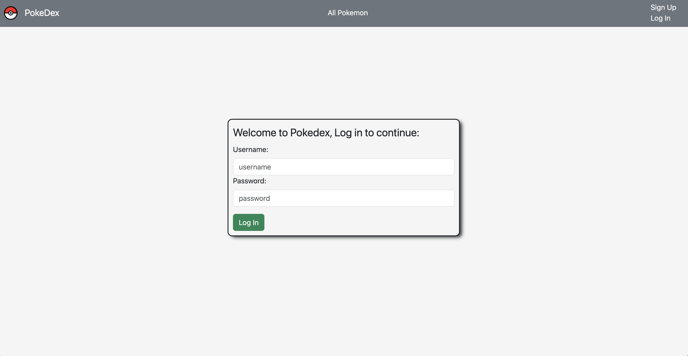

# PokeDex

An application that lets you track the pokemon that you have captured in the wild and leave notes about each of them! Organize your favorite Pokemon by favoriting them in the application for quick lookup.

# App URL:
- https://pokedex-ga1.fly.dev/

# User Stories
  - As a user, I want the ability to sign up.
  - As a user, I want the ability to sign in. 
  - As a user, I want the ability to sign out. 
  - As a user, I want the ability to view all Pokemon in a list.
  - As a user, I want the ability to view all of my captured Pokemon in a list.
  - As a user, I want the ability to view all of my favorite Pokemon in a list. 
  - As a user, I want the ability to update my favorites. 
  - As a user, I want the ability to update my captured. 
  - As a user, I want the ability to read more details of individual pokemon. 
  - As a user, I want the ability to delete my captured pokemon. 
  - As a user, I want the ability to add notes to my captured pokemon.
  - As a user, I want the ability to update notes to my captured pokemon.
  - As a user, I want the ability to delete notes to my captured pokemon.

# Wire Frame

# ERD

# Technologies Used

- JavaScript
- Node.js
- Express
- EJS
- CSS3
- https://pokeapi.co/
- bootstrap

# Fonts

- https://fonts.google.com/specimen/Seymour+One/tester

# V1 Images
      

# ICE BOX

- Add trainers and allow them to be assignable to pokemon